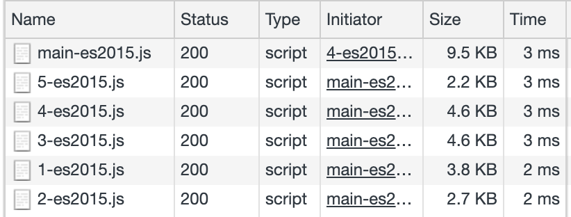

Orders 
==============================================================================================

### Fully functional Angular app as Web Component / Custom Element 

Can be hosted separately and referenced at runtime in Envelope app.

---
#### Technologies and tools used

- [Angular](https://angular.io/) with use of [Angular Elements](https://angular.io/guide/elements)
- [Web Components](https://developer.mozilla.org/en-US/docs/Web/Web_Components)
- [ngx-build-plus](https://github.com/manfredsteyer/ngx-build-plus)

Current status:
- :heavy_check_mark: Angular 8
- :heavy_check_mark: Lazy loading
- :heavy_check_mark: Lightweight bundles, size of micro app reduced to minimum

  
Details

  
    Date: 2019-06-17T17:43:28.547Z
    Hash: 0cbd6d10ab88118ad039
    Time: 6103ms
    chunk {0} main-es5.js (main) 9.22 kB [entry] [rendered]
    chunk {1} 1-es5.js () 3.48 kB  [rendered]
    chunk {2} 2-es5.js () 2.37 kB  [rendered]
    chunk {3} 3-es5.js () 4.29 kB  [rendered]
    chunk {4} 4-es5.js () 4.29 kB  [rendered]
    chunk {5} 5-es5.js () 1.91 kB  [rendered]
    chunk {scripts} scripts.js (scripts) 13.3 kB [entry] [rendered]
                                                                                   
    Date: 2019-06-17T17:43:32.376Z
    Hash: bd37670c2c0d70a4f024
    Time: 3803ms
    chunk {0} main-es2015.js (main) 9.11 kB [entry] [rendered]
    chunk {1} 1-es2015.js () 3.4 kB  [rendered]
    chunk {2} 2-es2015.js () 2.29 kB  [rendered]
    chunk {3} 3-es2015.js () 4.16 kB  [rendered]
    chunk {4} 4-es2015.js () 4.15 kB  [rendered]
    chunk {5} 5-es2015.js () 1.77 kB  [rendered]
    chunk {scripts} scripts.js (scripts) 13.3 kB [entry] [rendered]

- :heavy_check_mark: Angular router fully working (:grey_exclamation: with additional boilerplate)
- :x: Ivy compiler [[not supported yet]](https://github.com/angular/angular/issues/30262#issuecomment-497101996)

---
#### Pros:

- Tiny, small projects where business cases / domains are separated
(let's say, some kind of microservices on frontend),
- Fast, independent builds and feature delivery
- Blazing fast deployment of micro application,
- Much less conflicts comparing to one monolith app developed by multiple teams,
- Content not loaded, until used (lazy loading of micro applications / components,
  regardless of the technologies used inside),
- Easier to remove from the entire system, easier to transfer to another,
- Complexity of whole frontend project scales more horizontally instead of vertically, 
- Angular is not an only option.

#### Cons:

- Can be sometimes too coupled to Web Component / Angular Elements specifics,
- Boilerplate in every app to handle architecture and navigation
  (Angular Router is not ready for that case out of the box),
- Requires maintenance of additional Envelope app and shared services, guards etc.
  which is sometimes barely related to business cases, can be time-consuming
  and hard to debug,
- The less people work on the whole solution, the less it pays off,
- Too complex and over-designed solution if whole application and business
  cases are quite simple.

---
#### Setup / Usage / How to

###### Development server

Run `npm run start` for a dev server. Navigate to `http://localhost:4201/`.
The app will automatically reload if you change any of the source files.
You can also test production setup running `npm run start:prod`

###### Build

Run `npm run build` to build the project.
The build artifacts will be stored in the `dist/` directory.
Use `npm run build:aws` if you are hosting micro app just at different context (not domain)
or if are using some kind of gateway also for frontend assets and relative request path contexts are forwarded 
deep into the infrastructure.

###### Serve production build statics

Run `npm run server`

###### Running unit tests

Run `npm run test` to execute the unit tests via [Karma](https://karma-runner.github.io).

###### Running end-to-end tests

Run `npm run e2e` to execute the end-to-end tests via [Protractor](http://www.protractortest.org/).

---
#### Areas for improvements

- The less boilerplate and coupled to WC code the better
